# System Architecture Flowchart

**CodeArchitect MCP Ecosystem Project**

**Date**: November 14, 2025  
**Author**: Tair Kaldybayev  
**Links to**: S1-LO2 (Creating professional IT products)

---

## Introduction

This document provides visual flowcharts representing the system architecture and key workflows of the CodeArchitect MCP server. These diagrams illustrate how different components interact and how data flows through the system.

## System Overview Flow

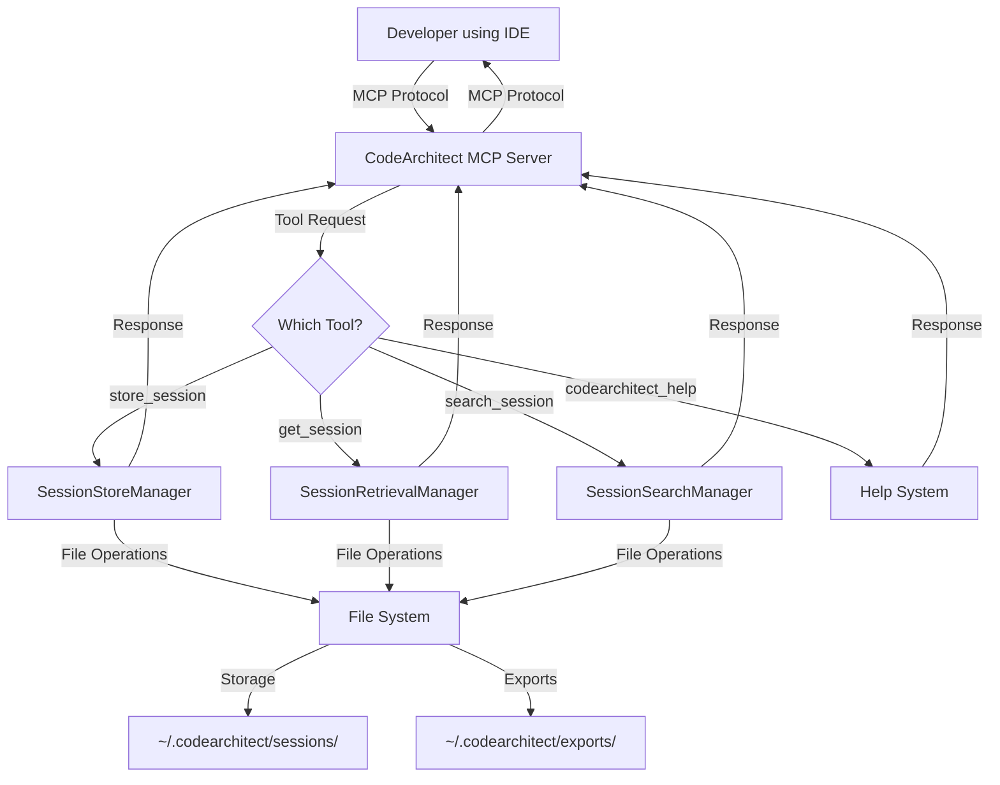

## Session Storage Flow

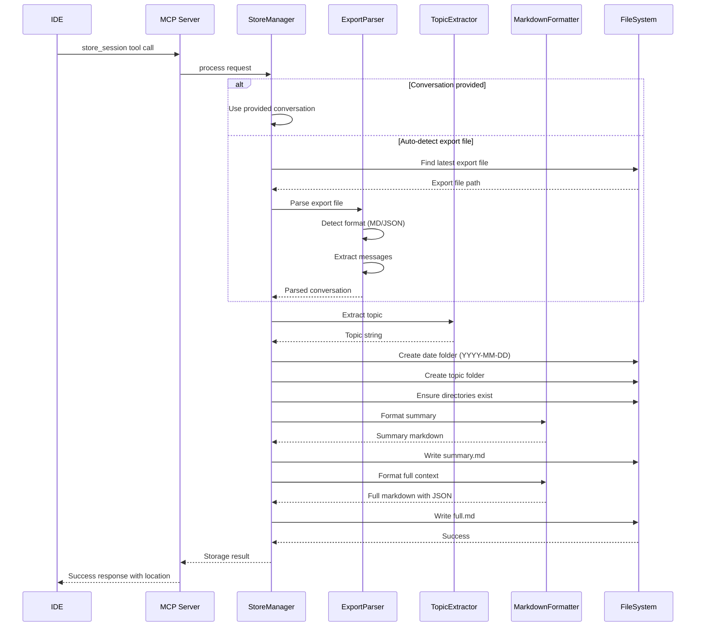

## Session Retrieval Flow

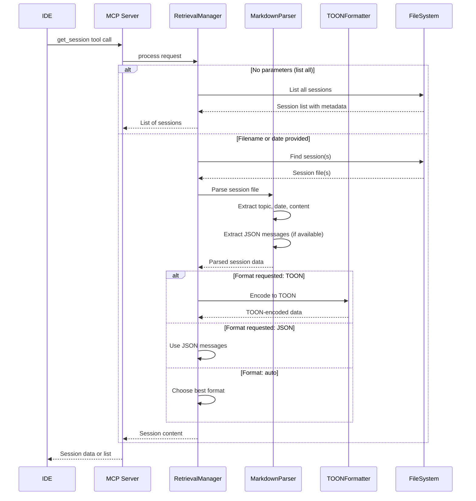

## Search Flow

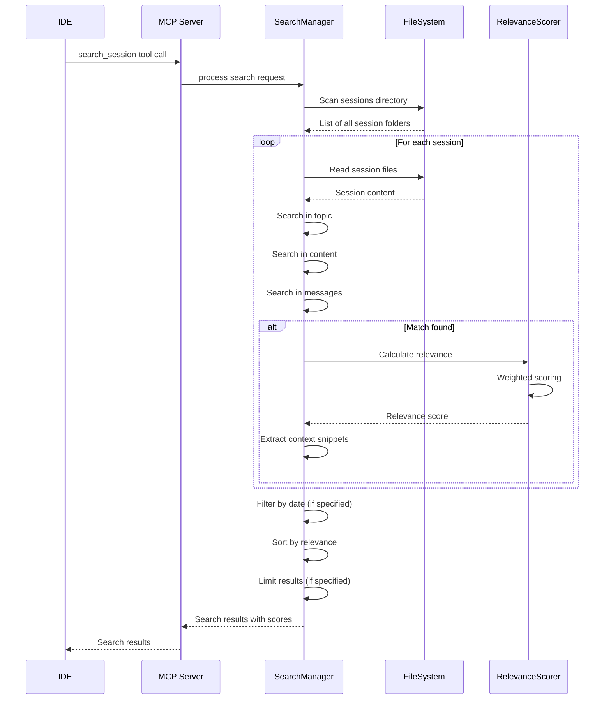

## Export File Detection Flow

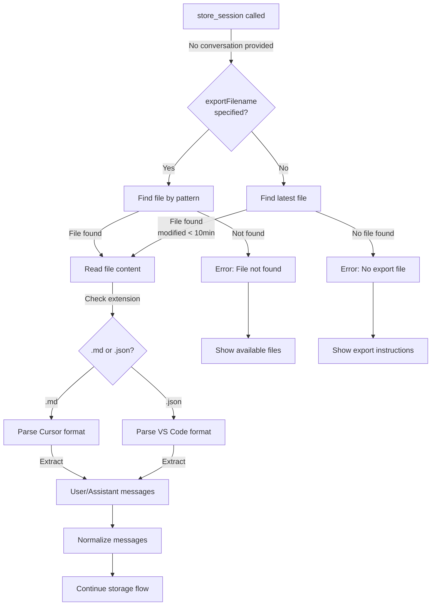

## MCP Protocol Interaction Flow

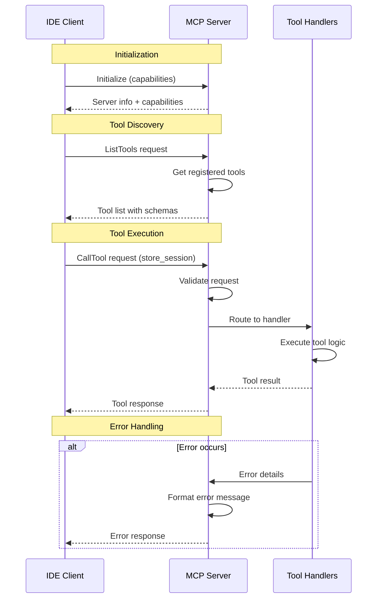

## File Storage Structure Flow

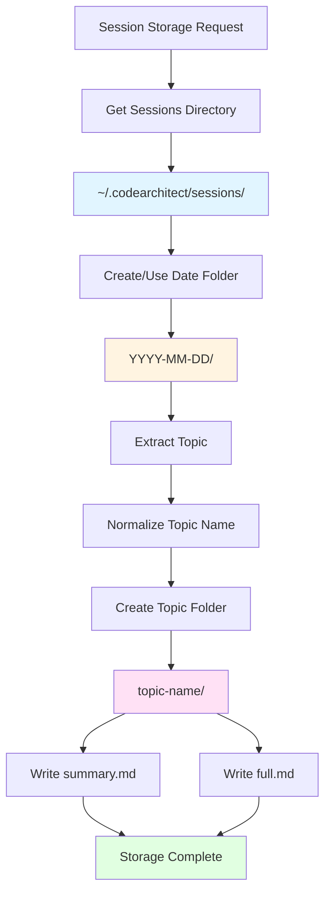

## Topic Extraction Flow

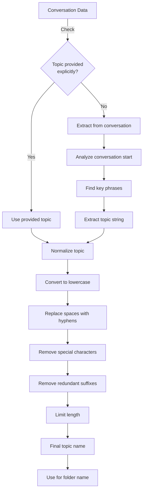

## TOON Format Conversion Flow

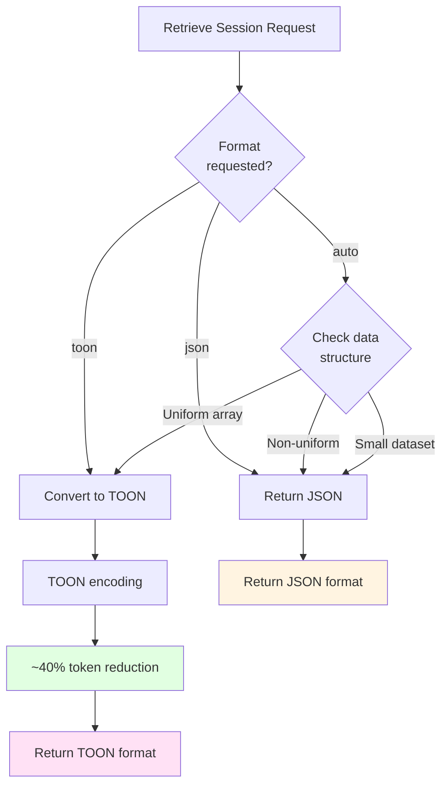

## Error Handling Flow

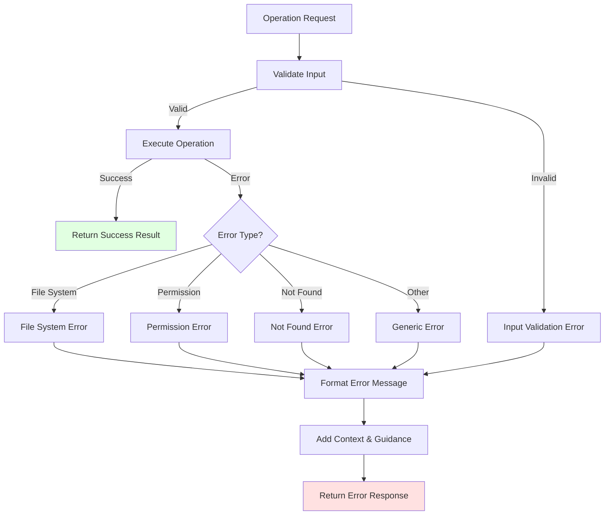

## Help System Flow

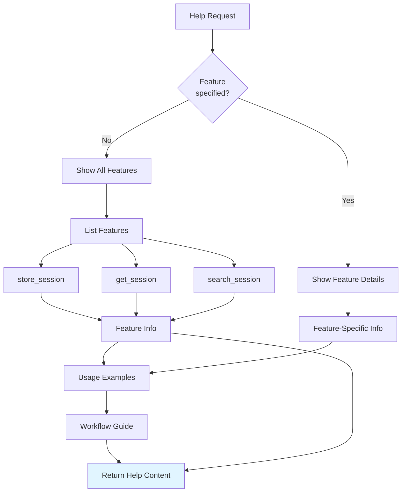

---

## Summary

These flowcharts illustrate the key workflows and architecture of the CodeArchitect MCP server:

1. **System Overview**: Shows how different components interact
2. **Session Storage**: Complete flow from request to file storage
3. **Session Retrieval**: How sessions are retrieved and formatted
4. **Search Flow**: How full-text search works across sessions
5. **Export Detection**: Auto-detection of export files
6. **MCP Protocol**: Interaction with IDE via MCP protocol
7. **File Structure**: How files are organized on disk
8. **Topic Extraction**: How topics are extracted and normalized
9. **TOON Format**: Token optimization conversion
10. **Error Handling**: Error processing and user feedback
11. **Help System**: Feature discovery and guidance

These diagrams help understand the system architecture and serve as documentation for development and maintenance.

---

**Document Status**: Completed during Week 2 design phase  
**Next Document**: Code Explanation Document (Week 3)

